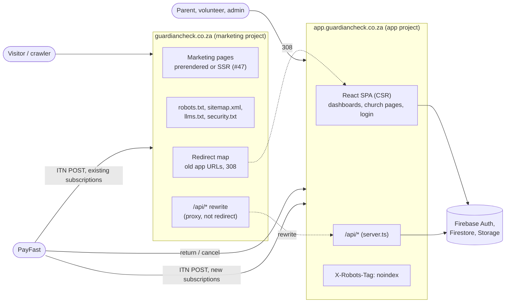

# Domain architecture plan: marketing apex and app subdomain

| | |
|---|---|
| **Issue** | [#50](https://github.com/KatOre-Solutions/GuardianCheck/issues/50) (7.1), part of epic [#14](https://github.com/KatOre-Solutions/GuardianCheck/issues/14) |
| **Status** | Proposed, awaiting review |
| **Depends on** | [#47](https://github.com/KatOre-Solutions/GuardianCheck/issues/47) (marketing rendering ADR), still open. See [Relationship to #47](#relationship-to-47). |
| **Companion docs** | [auth-session.md](auth-session.md) (7.2), [config-inventory.md](config-inventory.md) (7.3) |

This is a plan, not a change. Nothing here has been implemented, and no DNS,
Vercel, Firebase or PayFast setting has been touched.

## Summary

Today one Vercel project serves one React SPA on `guardiancheck.co.za`. That
single SPA contains both the marketing site and the authenticated app.

The target is two hosts:

- **`guardiancheck.co.za`** (the apex) serves only the marketing site: home,
  about, contact, legal pages, and whatever #47 adds. It is prerendered or
  server-rendered, indexable, and carries the sitemap, `robots.txt` and
  `llms.txt`.
- **`app.guardiancheck.co.za`** serves the authenticated application as the
  client-rendered SPA it already is, plus the `/api` server. Every church URL
  (`/grace`, `/grace/admin`, ...) moves here. Nothing on this host is indexed.

Old apex URLs for app pages keep working through permanent redirects. The apex
also keeps answering `/api/*`, by proxying to the app host rather than
redirecting, because PayFast keeps sending recurring-billing notifications to
the address it was originally given.

Because the two hosts are different browser origins, a user's sign-in, offline
data and installed app do **not** carry over. Everyone signs in once more on
the app host. The migration is phased so that this happens gradually, with the
apex still fully working, before the apex is switched to marketing. See
[Migration phases](#migration-phases).

## Scope

In scope: target topology, which host owns which URL, SEO implications of a
subdomain, the indexing policy per host, `robots.txt`/sitemap per host, the
redirect map, and an ordered migration checklist.

Out of scope (per #50): implementation, per-tenant subdomains
(`grace.guardiancheck.co.za`), and DNS changes. DNS appears in the checklist
only as a step someone will eventually perform.

## Current state

| Aspect | Today | Source |
|---|---|---|
| Hosting | One Vercel project. `@vercel/static-build` serves `dist/`, `@vercel/node` serves `server.ts` for `/api/*`. | [vercel.json](../../vercel.json) |
| Origin | `https://guardiancheck.co.za`, hard-coded as `SITE_URL` and used for every canonical, the sitemap and JSON-LD. | [src/constants/site.ts](../../src/constants/site.ts) |
| App shape | One SPA. `Layout variant="marketing"` wraps `/`, `/about`, `/contact` and the legal pages; everything else uses the app layout. | [src/App.tsx](../../src/App.tsx) |
| Route manifest | `EXACT_ROUTES`, tenant child routes, `RESERVED_SLUGS`. `vercel.json` routes are generated from it and the build fails if they drift. | [src/constants/appRoutes.ts](../../src/constants/appRoutes.ts), [scripts/generate-vercel-routes.ts](../../scripts/generate-vercel-routes.ts) |
| Tenant URLs | `/:churchSlug` at the top level, any single segment not in `RESERVED_SLUGS`. Already `noindex` (#18). | [src/pages/ChurchLanding.tsx](../../src/pages/ChurchLanding.tsx) |
| Rendering | Client-side only. Social unfurlers see only the static tags in `index.html`. | [src/components/Seo.tsx](../../src/components/Seo.tsx), [index.html](../../index.html) |
| SEO files | `public/robots.txt` (static), `dist/sitemap.xml` and `dist/llms.txt` (generated from `PUBLIC_ROUTES`). | [scripts/generate-sitemap.ts](../../scripts/generate-sitemap.ts), [scripts/generate-llms-txt.ts](../../scripts/generate-llms-txt.ts) |
| PWA | Manifest `start_url: /app`, `scope: /`, service worker precaches the whole shell. | [public/manifest.webmanifest](../../public/manifest.webmanifest), [public/sw.js](../../public/sw.js) |
| Auth | Firebase Web SDK, session in IndexedDB, API calls carry a bearer ID token. No cookies. | [auth-session.md](auth-session.md) |

## Target topology

### Hosts

| Host | Serves | Rendering | Indexing | Vercel project |
|---|---|---|---|---|
| `guardiancheck.co.za` | Marketing pages, SEO/GEO files, redirect map, `/api` proxy | Prerendered or SSR, per #47 | Indexable | `guardiancheck-marketing` (new) |
| `www.guardiancheck.co.za` | Nothing | n/a | n/a | 308 to apex, same path (confirm current behaviour, see [Open questions](#open-questions)) |
| `app.guardiancheck.co.za` | SPA, `/api`, PWA manifest and service worker | CSR (unchanged) | `noindex` everywhere | Existing project, re-pointed |
| `*.vercel.app` previews | Either project | As above | `noindex` | Both |

**Why keep the existing Vercel project for the app, not the marketing site:**
the app project holds all the production environment variables (Firebase Admin,
PayFast, Resend, Discord) and the deploy pipeline. Re-pointing its domain is a
settings change; recreating those secrets in a new project is where mistakes
happen. The marketing project needs almost no secrets.

**One repository, two projects.** The two builds must keep sharing
single-sourced facts: pricing (`src/constants/plans.ts`), company details
(`src/constants/company.ts`), legal text (`src/constants/legalContent.ts`,
also shown in-app on the policy acceptance page), and site identity
(`src/constants/site.ts`). Splitting into two repositories would duplicate
these and let them drift, which is the exact failure the current code comments
warn about. The folder layout (workspaces, a `marketing/` directory, or
Vercel root directories) is a #47 implementation detail.

## Route ownership

Every route in [appRoutes.ts](../../src/constants/appRoutes.ts), and where it
lives after the split.

| Current path | Owner after split | Apex behaviour after cutover | Notes |
|---|---|---|---|
| `/` | Marketing | Serves home | App host `/` becomes the launch redirect (same as `/app`). |
| `/about`, `/contact` | Marketing | Serves page | |
| `/privacy`, `/terms`, `/popia`, `/cookies`, `/security` | Marketing | Serves page | App links to them absolutely. Legal text stays shared for the in-app acceptance flow. |
| `/register-church` | **App** | 308 to app host, query kept (`?plan=`) | Creates a Firebase account, so it must run on the origin the user will stay signed in on. Drops out of the apex sitemap. The home page's pricing section carries the indexable content. A dedicated marketing "free trial" page is a possible later addition, not part of this plan. |
| `/login` | App | 308 | |
| `/accept-invite` | App | 308, query kept (`?token=`) | Invite emails already sent point at the apex. |
| `/complete-profile`, `/pending-approval`, `/rejected`, `/policy-acceptance` | App | 308 | |
| `/app` | App | 308 | PWA `start_url`. |
| `/admin`, `/volunteer`, `/parent` | App | 308, query kept (`?payment=`) | PayFast `return_url` targets `/admin`. |
| `/profile`, `/master-admin`, `/master-admin/logs` | App | 308 | |
| `/:churchSlug` and every tenant child route | **App** | 308 for any path that is not a marketing path | QR posters, WhatsApp messages and bookmarks already point here. |
| `/api/*` | App | **Rewrite (proxy)** to app host | See [PayFast ITN](#why-api-is-proxied-not-redirected). |
| `/sw.js` | App | Serves a self-unregistering worker | See [Service worker on the apex](#service-worker-on-the-apex). |
| `/manifest.webmanifest`, `/offline.html`, app icons | App | Removed (icons kept if marketing uses them) | Marketing is not installable. |
| `/robots.txt`, `/sitemap.xml`, `/llms.txt` | Both, different content | Marketing versions | See [Indexing policy](#indexing-policy-per-host). |
| `/.well-known/security.txt` | Both | Served | Same contact; `Canonical` differs per host. |
| `/assets/*` | Each project its own | Marketing assets | Old hashed app chunks disappear from the apex; `lazyWithReload` reloads, which then hits a redirect. |

### The slug rule (important)

Tenant URLs are top-level single segments, so the apex cannot list them. The
redirect rule is therefore:

> On the apex, any path that is **not** a marketing path, a SEO file, `/api/*`
> or a marketing asset is redirected with 308 to the same path on the app host.

That makes the set of marketing paths a contract between the two projects. If
the marketing site later adds `/pricing` or `/blog`, and a church has already
registered the slug `pricing` or `blog`, that church's poster URL silently
starts showing a marketing page.

Required before cutover:

1. Define the marketing path list in one shared module (for example a
   `MARKETING_ROUTES` constant) that the apex redirect config is generated
   from, the same way `vercel.json` is generated today.
2. Feed that list into `RESERVED_SLUGS`, **and make the server enforce it**.
   Today it does not: `/api/register-church`
   ([server.ts:2292-2307](../../server.ts#L2292-L2307)) derives the slug from
   the church name and checks only uniqueness. A church registering as "About"
   or "Login" already gets a slug the router treats as reserved, so its page is
   unreachable. This is a pre-existing bug, tracked independently of the split
   in [#143](https://github.com/KatOre-Solutions/GuardianCheck/issues/143). When a derived slug is reserved, append a suffix the same way a
   duplicate slug is handled.
3. Reserve likely future marketing paths now, before any church claims them:
   `pricing`, `features`, `blog`, `resources`, `guides`, `faq`, `demo`,
   `churches`, `schools`, `partners`, `careers`, `press`, `help`, `support`,
   `docs`, `status`, `legal`, `start`, `signup`, `trial`.
4. Query production for existing churches already holding any of those slugs,
   and resolve each one before the path is used by marketing. Churches cannot
   change their slug themselves (the settings endpoint does not accept it), so
   resolving a clash means a manual slug change plus telling that church to
   reprint its QR material. Doing the reservation early keeps this list empty.

## Why a subdomain and not a subdirectory

The alternative is `guardiancheck.co.za/app/...` with an edge rewrite to the app
project, which keeps one origin.

| | Subdomain `app.` | Subdirectory `/app/` |
|---|---|---|
| SEO authority | No loss. The app host has nothing indexable; all indexable content stays on the apex. The common "subdomains dilute authority" concern applies to content, not to a login-walled app. | Same |
| Browser origin | New origin: one-time re-login, PWA reinstall, offline cache rebuilt ([auth-session.md](auth-session.md)) | Same origin: sessions and installs survive |
| URL changes for users | Host changes, paths stay the same | Every app path gains `/app/` and tenant URLs change shape |
| Isolation | Marketing JavaScript can never read app storage; a marketing-side XSS cannot reach a signed-in session | Marketing and app share storage, cookies and service worker scope |
| Deploy independence | Full: separate projects, domains, headers, caching | Partial: one domain's edge config must route between two projects |
| Service worker | Scoped to the app host only | Must be scoped to `/app/`, and the existing worker at `/` must be retired anyway |
| Indexing policy | One header on the whole host | Path-based rules that can be got wrong |

The subdomain costs a one-time re-login and reinstall. The subdirectory avoids
that but changes every app URL anyway, and it keeps the marketing site and a
children's safeguarding app in the same browser security boundary. Since the
marketing site is about to be rebuilt on a different stack (#47), that
isolation is worth the one-time cost. **Recommendation: subdomain, as the epic
proposes.**

## Indexing policy per host

### Apex (`guardiancheck.co.za`)

- `robots.txt`: allow everything, `Disallow: /api/`, `Sitemap:` line. The
  current app-route `Disallow` lines are removed; those paths are now
  redirects and a redirect is not crawlable content anyway.
- `sitemap.xml`: generated from the marketing route list, minus
  `/register-church`.
- `llms.txt`: generated as today. Its closing note about `/login` changes to
  say the application lives on `app.guardiancheck.co.za` and is not indexed.
- Canonicals, `og:url` and JSON-LD `url` all use the apex origin, as today.
- The Organization JSON-LD keeps `url: https://guardiancheck.co.za`.

### App host (`app.guardiancheck.co.za`)

- Every HTML response carries `X-Robots-Tag: noindex, nofollow`, set once in
  the app project's headers config so no route can forget it.
- `index.html` carries a static `<meta name="robots" content="noindex, nofollow">`
  as a second layer for anything reading HTML without headers. `<Seo>` must
  stop removing it (today it removes the robots meta on indexable routes).
- `robots.txt` does **not** say `Disallow: /`. A crawler blocked by
  `robots.txt` never fetches the page, never sees `noindex`, and can still
  index the bare URL from inbound links (QR posters, WhatsApp shares). Allowing
  the crawl is what lets `noindex` work. It keeps `Disallow: /api/` and has no
  `Sitemap:` line.
- No canonicals, no JSON-LD, no social tags beyond a neutral title. Shared
  church links do not need a rich card; if that changes later it is a separate
  decision.
- Search Console: add the app host as a property only to monitor that nothing
  gets indexed. Do not submit a sitemap for it.

### Previews

Vercel preview URLs should already send `X-Robots-Tag: noindex`. Verify for
both projects once the marketing project exists. Canonicals stay pinned to the
production apex, as [site.ts](../../src/constants/site.ts) already insists.

## Redirects and proxies on the apex

| Match | Action | Status | Why |
|---|---|---|---|
| `www.guardiancheck.co.za/*` | Redirect to apex, same path and query | 308 | One canonical host |
| Marketing paths, SEO files, marketing assets | Serve | 200 | |
| `/api/*` | Rewrite to `https://app.guardiancheck.co.za/api/*` | Proxy | PayFast ITN, old clients |
| `/sw.js` | Serve kill-switch worker | 200 | Retire the old app worker |
| Everything else | Redirect to `https://app.guardiancheck.co.za` + same path + same query | 308 | Old app and church URLs |

308 rather than 301 because it forbids a client from turning a POST into a GET.
No app page receives a POST today, but the choice costs nothing. Search engines
treat 308 as permanent, like 301.

Unknown junk paths (`/some/deep/nonsense`) also get redirected and then 404 on
the app host. That is acceptable: the app host is `noindex`, and the apex does
not need to know the app's route shapes.

### Why `/api` is proxied, not redirected

PayFast recurring billing sends an ITN (instant transaction notification)
for every future charge. The `notify_url` comes from the original checkout form
([PayFastButton.tsx](../../src/components/PayFastButton.tsx)), so every church
that subscribed before the split will keep receiving ITNs at
`https://guardiancheck.co.za/api/payfast-itn`. PayFast's handling of an HTTP
redirect on an ITN POST is not documented; if it does not follow, those churches'
renewals are silently never recorded. Confirm with PayFast support, but do not
depend on the answer: a rewrite forwards the exact request body, and the ITN
handler in `server.ts` validates by signature and PayFast ping-back, not by
source IP or host, so proxying is transparent to it.

The same rewrite keeps any old apex tab or old cached shell working while it
still calls relative `/api` paths.

**This rewrite is permanent** for as long as any pre-split subscription exists.

### Service worker on the apex

Every device that has visited the current site has `sw.js` registered on the
apex with `scope: /`. Its navigation handler fetches from the network first and
serves the cached app shell when offline. After cutover, an offline visit to
the apex would boot the **old app** from cache, on an origin where it no longer
belongs.

The marketing project must therefore serve a replacement `/sw.js` that, on
`activate`, deletes every `guardiancheck-shell-*` cache, calls
`self.registration.unregister()`, and navigates open clients to reload. Browsers
re-check the worker script on navigation, so this reaches each device on its
next online visit. Keep it deployed for at least 12 months.

## Relationship to #47

#47 picks the marketing rendering approach (Next.js, React Router SSR, Astro,
or other). This plan is written to hold for any of them. What the split needs
from whatever #47 chooses:

1. Deployable as its own Vercel project with custom domains.
2. Edge redirects and rewrites expressible in config (all candidates can, via
   `vercel.json` or framework config).
3. Able to import TypeScript constants from the shared modules listed above.
4. A way to emit the kill-switch `sw.js` and `security.txt` as static files.
5. Per-route head tags rendered server-side, which replaces the imperative
   [Seo.tsx](../../src/components/Seo.tsx) on the marketing side.

Sections of this plan that become concrete once #47 is decided: the folder
layout, the marketing build command, how the redirect config is generated, and
which marketing components move versus get rewritten. They are marked
**(#47)** in the checklist.

**Can the split happen before #47 lands?** Yes, if needed: phases 0 to 2 below
do not touch the marketing stack at all. Only phase 3 needs the new marketing
build. A stop-gap (deploying today's SPA with only the marketing routes to the
apex) is possible but would mean doing the marketing project twice, so it is not
recommended.

## Migration phases

Each phase is independently shippable and has a rollback. Nothing user-visible
breaks until phase 3, and phase 3 is only a domain and config change on top of
work already proven in phase 2.

### Phase 0: preparation (code, no behaviour change)

Make the code host-aware while both hosts are still the same host.

- Split `SITE_URL` into `MARKETING_URL` (apex) and `APP_URL` (app host) in
  `site.ts`. Both are `https://guardiancheck.co.za` for now.
- Route every cross-host link in the [inventory](config-inventory.md) through
  those constants. Marketing to app links become absolute app URLs; app to
  marketing links become absolute marketing URLs.
- Extend `RESERVED_SLUGS` with the marketing path list and check production for
  clashes.
- Remove `useAuth` from `MarketingHeader` and `DemoInvite`
  ([auth-session.md](auth-session.md#marketing-host-has-no-auth-state)).

Rollback: revert the PR. Nothing observable changed.

### Phase 1: stand up the app host in parallel

- DNS: `app` CNAME to Vercel. Leave apex, `www`, MX and TXT records untouched.
- Attach `app.guardiancheck.co.za` to the **existing** Vercel project, alongside
  the apex. Both hosts now serve the identical SPA and API.
- App host gets `X-Robots-Tag: noindex, nofollow` (header rule by host).
- Firebase Auth authorized domains, reCAPTCHA Enterprise key domains: add the
  app host.
- Test on the app host: email sign-in, Google sign-in, invite acceptance,
  verification email, PayFast sandbox checkout and ITN, QR scanning, PWA install,
  offline parent QR.

Rollback: detach the domain. No user was sent there.

### Phase 2: send new traffic to the app host

- Set `APP_URL` and `VITE_APP_URL` to `https://app.guardiancheck.co.za` in the
  production environment and redeploy. New verification emails, invite links
  and PayFast return and notify URLs now point at the app host.
- Set the `MARKETING_URL`/`APP_URL` constants to their real values. Marketing
  CTAs on the apex now link to the app host.
- On the apex only, show signed-in users a dismissible notice: "GuardianCheck
  has moved to app.guardiancheck.co.za. Open it there and sign in once. If you
  installed the app, install it again from the new address."
- Soak for at least 3 weeks (3 Sundays), watching sign-ins per host, ITN
  success, and support messages. The apex keeps serving the full app, so
  anyone who has not moved yet is unaffected.

Rollback: set the env vars back and redeploy. Links already emailed to the app
host keep working because the app host stays up.

### Phase 3: cutover the apex to marketing

Do this on a Monday or Tuesday morning, never close to a Sunday.

- Deploy the marketing project **(#47)** with the redirect map, `/api` rewrite,
  kill-switch `sw.js`, and its own `robots.txt`, sitemap, `llms.txt` and
  `security.txt`.
- Move `guardiancheck.co.za` and `www` from the app project to the marketing
  project. The app project keeps only `app.guardiancheck.co.za`.
- Smoke test the [verification list](#post-cutover-verification) immediately.

Rollback: move the apex domain back to the app project. Because phase 2 kept the
app fully working on the apex, this restores the previous state within DNS and
edge propagation time (minutes on Vercel, since DNS does not change).

### Phase 4: clean up

- After 30 days: remove the apex from Firebase authorized domains and the
  reCAPTCHA key (the apex no longer runs Firebase Auth). Remove the phase 2
  notice.
- Search Console: resubmit the apex sitemap; confirm the old app URLs show as
  redirects and the app host shows zero indexed pages.
- Keep permanently: the redirect map, the `/api` rewrite, the reserved slugs.
- Keep for 12 months: the kill-switch `sw.js`.

## Migration checklist

Item IDs in brackets refer to [config-inventory.md](config-inventory.md).

### Phase 0: preparation
- [ ] #47 ADR approved and marketing framework chosen
- [ ] Split `SITE_URL` into `MARKETING_URL` and `APP_URL` constants [B1]
- [ ] Marketing CTAs use absolute app URLs [E1 to E6]
- [ ] App links to marketing and legal pages use absolute marketing URLs [E7 to E16]
- [ ] App host `/` renders the launch redirect instead of Home [F3]
- [ ] Sign-out lands on the app login, not the marketing home [E9]
- [ ] Remove `useAuth` from `MarketingHeader` and `DemoInvite` [E1, E17]
- [ ] Server enforces reserved slugs at registration ([#143](https://github.com/KatOre-Solutions/GuardianCheck/issues/143)) [F4]
- [ ] Shared `MARKETING_ROUTES` list created; `RESERVED_SLUGS` includes it and the future list [F4]
- [ ] Production query for churches holding a reserved slug; each clash resolved [F4]
- [ ] Hard-coded apex fallbacks in `server.ts` read from config [C1, C2]
- [ ] Church settings slug prefix shows the app host [B5]
- [ ] Marketing mock-up browser frames show the app host [B6]
- [ ] `<Seo>` keeps a static robots meta on the app build [G6]

### Phase 1: app host in parallel
- [ ] DNS `app` CNAME added; MX, SPF, DKIM and ImprovMX records confirmed unchanged [J5]
- [ ] App host attached to the existing Vercel project [J4]
- [ ] `X-Robots-Tag: noindex, nofollow` on the app host, verified with `curl -I` [G5]
- [ ] App host `robots.txt` (no `Disallow: /`, no sitemap) [G1]
- [ ] Firebase authorized domains include the app host [J1]
- [ ] reCAPTCHA Enterprise key allows the app host [J2]
- [ ] End-to-end test pass on the app host (list in Phase 1 above)
- [ ] PayFast sandbox checkout completes and the ITN is recorded with app host URLs [D1 to D3]

### Phase 2: new traffic to the app host
- [ ] `APP_URL` and `VITE_APP_URL` set to the app host in Production; Preview left empty to fall back to the request origin [A1, A2]
- [ ] Constants set to real values and deployed [B1]
- [ ] New verification and invite emails checked to contain app host links [C1 to C4]
- [ ] Live PayFast payment returns to the app host and the ITN is recorded [D1 to D3]
- [ ] "We've moved" notice live on the apex for signed-in users [I1]
- [ ] Churches told in advance (email or WhatsApp) about the new address, re-sign-in and reinstall
- [ ] 3 Sundays of soak with no unexplained drop in check-ins

### Phase 3: cutover
- [ ] PayFast confirmed (or accepted as unknown) on ITN redirect behaviour; `/api` rewrite in place regardless [D4]
- [ ] Marketing project built and deployed to a preview URL **(#47)**
- [ ] Redirect map generated from the shared route list and tested against every row in [Route ownership](#route-ownership) [F5]
- [ ] Kill-switch `sw.js` in the marketing build [H2]
- [ ] Marketing `robots.txt`, `sitemap.xml`, `llms.txt`, `security.txt` [G1 to G4]
- [ ] Apex and `www` moved to the marketing project on a weekday morning [J4]
- [ ] [Post-cutover verification](#post-cutover-verification) passed

### Phase 4: cleanup
- [ ] Apex removed from Firebase authorized domains and reCAPTCHA (after 30 days) [J1, J2]
- [ ] "We've moved" notice removed [I1]
- [ ] Search Console: apex sitemap resubmitted; app host has zero indexed pages [J7]
- [ ] README and `.env.example` updated [K1, K2]

### Post-cutover verification

Run against production immediately after phase 3:

- [ ] `curl -I https://guardiancheck.co.za/` is 200 with marketing HTML
- [ ] `curl -I https://guardiancheck.co.za/login` is 308 to `https://app.guardiancheck.co.za/login`
- [ ] `https://guardiancheck.co.za/accept-invite?token=abc` redirects with `?token=abc` intact
- [ ] `https://guardiancheck.co.za/<a real church slug>` redirects to the app host and shows that church
- [ ] `https://guardiancheck.co.za/admin?payment=success&plan=starter` redirects with the query intact
- [ ] `curl -X POST https://guardiancheck.co.za/api/health` reaches the app server (proxied, not redirected)
- [ ] `https://guardiancheck.co.za/sitemap.xml` lists only marketing URLs on the apex
- [ ] `curl -I https://app.guardiancheck.co.za/` carries `X-Robots-Tag: noindex, nofollow`
- [ ] `https://www.guardiancheck.co.za/about` is 308 to the apex
- [ ] A device that had the old app installed: opening the apex online unregisters the old worker

## Risks

| # | Risk | Likelihood | Impact | Mitigation |
|---|---|---|---|---|
| R1 | Renewals for existing subscriptions not recorded because ITNs hit the apex | High without the rewrite | High: churches locked out despite paying | Permanent `/api/*` rewrite on the apex; watch ITN logs after cutover |
| R2 | A church's slug collides with a future marketing path | Medium | High for that church: their poster URL shows a marketing page | Shared route list, reserved slugs, production clash check |
| R3 | Parents arrive on a Sunday signed out or offline with no cached QR | Medium | High at the check-in desk | Phase 2 soak and notice, weekday cutover, church comms; volunteers can still look children up |
| R4 | Old service worker boots the old app on the apex while offline | High for installed users | Medium: confusing, and possibly stale data | Kill-switch worker |
| R5 | App host pages get indexed | Low | Low to medium | Header plus meta `noindex`; crawlable robots; Search Console monitoring |
| R6 | Redirect drops the query string (invite token, payment result) | Low | Medium | Explicit test rows in post-cutover verification |
| R7 | Sender reputation or email DNS disturbed by DNS edits | Low | High | Only add the `app` record; confirm MX, SPF and DKIM before and after |
| R8 | Shared constants drift between the two builds | Medium over time | Medium: wrong prices or legal text | One repo, imported modules, no copies |
| R9 | Marketing build slips because #47 is undecided | Medium | Low | Phases 0 to 2 do not need it |

## Open questions

1. **`www` today.** Is `www.guardiancheck.co.za` configured in Vercel, and does
   it redirect to the apex? Check the Vercel domains page.
2. **PayFast ITN redirects.** Does PayFast follow a 3xx on an ITN POST? The plan
   does not depend on the answer, but it decides whether the rewrite could ever
   be retired.
3. **Deploy pipeline.** The README describes deploys from
   `.github/workflows/deploy.yml`, but that file is not in the repository tree.
   Confirm where production deploys are triggered, since phase 3 adds a second
   project that needs the same pipeline.
4. **Vercel plan.** Confirm two projects and the domain moves are allowed on the
   current plan.
5. **Rich cards for church links.** Should a shared `app.guardiancheck.co.za/grace`
   link unfurl with the church's name in WhatsApp? Out of scope here, but it
   would need server-rendered tags on the app host.
